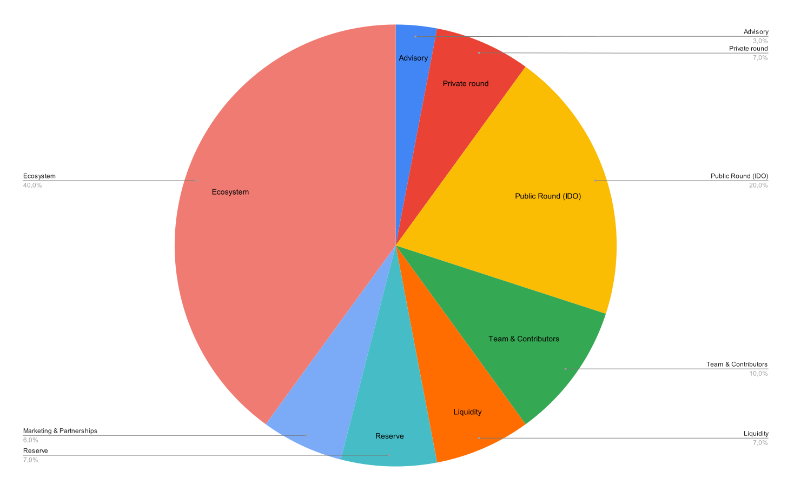

# **Introduction**

Traditional advertising must improve in the era of digital technologies and information noise. Consumers are tired of intrusive messages, and advertisers are looking for new ways to engage with their audience. **GeoToken** represents a solution at the intersection of geolocation technologies, cryptocurrencies, the advertising industry, and gamification.

There's nothing new to invent in advertising when global giants pour billions of dollars into development and innovation. However, not all ideas and solutions are exhausted. That's why tens of thousands of startups continue to search, offering the easiest and optimal solutions to the challenges of the new reality.

**GeoToken is a platform that rethinks the approach to advertising** and brand interaction with consumers. **Our mission** is to create an ecosystem where users' attention is valued and rewarded, and advertisers can access an engaged audience at the right time and place.

We aim to deliver information that makes each consumer feel unique and essential. We are here to tell you about **GeoToken**, a revolution that begins today. Join us and become part of this story.

With **GeoToken**, every user becomes part of an exciting and valuable process, and advertisers find their customers exactly when they need them.

**Key Features of GeoToken:**

1\.   **Attention Reward:** Users receive tokens to view advertising content.  
2\.   **Geolocation Targeting:** Advertising becomes relevant thanks to the user's location.  
3\.   **Interactivity:** Users actively participate in advertising campaigns rather than passively consuming content.  
4\.   **Blockchain Technology:** Using **Solana** ensures transparency and transaction security.

In this document, we will examine the problems of the modern advertising industry in detail, present: 

* Eco-friendly solution.  
* Describe the technical aspects of the **GeoToken** platform.  
* Outline the tokenomics of the project.  
* Discuss development plans and potential market impact.

Join us in creating a future where advertising becomes a valuable and rewarding experience for all market participants.

# **The Problem** 

"If your business is not on the internet, then your business does not exist."

   
Due to active digitalization, the advertising sector has significantly transformed, ensuring online presence through computers and mobile devices. Although radio and television advertising campaigns have expanded their audience, they have yet to introduce significant innovations in consumer interaction methods. Traditional advertising methods such as outdoor billboards, radio, and television are losing effectiveness due to increased attention to digital channels, which offer interactivity and instant access to information.

However, digital advertising faces the problem of untimely display when advertising materials may appear inappropriate, such as during an online game or watching a series, causing user dissatisfaction. In contrast, outdoor advertising can be more appropriate as it meets a potential client in real time and space, for example, by offering a promotion when passing by a store.

Outdoor advertising has its drawbacks. What if it's not this intersection but the next one? Knowing about promotions there, you might be okay with walking or driving an extra block. Outdoor advertising needs more interactivity. The latest but outdated developments include the introduction of QR code systems and the unsuccessful attempts to implement augmented reality (AR). Why, having mobile phones, are you still handed paper products by a promoter?

**Difficulties in Measuring Effectiveness.**  
One of the main problems of outdoor advertising is the need for more accurately measuring its impact on the consumer. Different from digital advertising, which can precisely track user interaction with an advertising message, this is much harder to do with outdoor advertising.

**Environmental Issue.**  
The production and disposal of advertising materials, especially paper and plastic, negatively impact the environment. With growing environmental awareness, this aspect may play an increasingly important role.

Modern cities are oversaturated with advertising messages, creating information noise. Billboards, posters, and signs all vie for the passerby's attention, reducing the effectiveness of individual advertising mediums. In such an environment, it is difficult to stand out and attract consumer attention, especially with significant spending on creativity and location.

Sadly, most fail to experience the "big game" without making a loud statement.

* A delicious coffee will only be drunk by neighbors.   
* An excellent burger will only be eaten by relatives.   
* Only friends will come to the beauty salon.

Hundreds of thousands of such examples exist in every country and city. Dreams, successes, and grand goals crash or turn into everyday routines.

But it can be different. There is an unprecedented opportunity to quickly, easily, and efficiently advertise your "point" online without having a website or page at the initial stage. We want to help such budding entrepreneurs by creating a new platform with quality, understandable, and quickly adjustable online advertising. Most importantly, we want to make it mutually beneficial for both the advertiser and the consumer.

In a fiercely competitive environment and market struggle, advertising has evolved and become more intrusive, aggressive, and sometimes toxic. For many, the word "advertising" evokes negative emotions. Let's try to offer a different approach.

# **Solutions and Product** 

"Advertising" \= "Commercial Communication." 

First, let's return to the essence of what lies behind the concept of **"advertising" \- it is communication between two parties**, one of which has something to offer, and the other has a need and interest in the delivered product, service, information, etc. Before it became intrusive and a one-sided game, it was regular communication. Since it mainly involves trade or exchange, it is **commercial communication.** Since we are addressing this problem, let's start with ourselves. Let's try to remove the word "advertising" from our text and, with our solution, return to this concept of its former eco-friendliness and equality.

So, we propose a model where funding for traditional commercial communication channels is redirected to reward consumers for their direct attention to brand messages. This will increase consumer interest in commercial messages and allow companies and agencies to focus on creating more creative and, thus, more compelling content. This strengthens the interaction between brands and their audience, fostering the development of innovative approaches in the paid attention industry. The level of interactivity in such communications can be brought to an entirely new level.

Let's summarize what modern commercial communications should be:

* **Timely:** Commercial messages should reach the audience at the most appropriate moment. This could be:  
  * A specific time of day.  
  * A particular event.  
  * Product or service seasonality.  
  * The moment of making a purchase decision.

* **Location-based:** Using user location data to show relevant messages:  
  * Notifications about nearby stores and cafes.  
  * Advertising of events and services in immediate proximity.

* **Interactive:** Engaging consumers in the communication process:  
  * Interactive videos, games, surveys, quizzes.  
  * Social networks and apps that allow commenting, sharing, and participating in content creation.

* **Targeted:** Achieving specific marketing goals by addressing the target audience:  
  * Messages based on user preferences and behavior data.  
  * Personalized offers matching interests and needs.

* **Rewarding:** Offering the user a reward for attention to commercial content:  
  * Watching videos, installing apps, participating in surveys  
  * Rewards include virtual currencies, bonuses, discounts, and coupons for goods and services.

Rewarding users is the cornerstone for improving the quality of commercial communications in the specified aspects. This approach significantly enhances interaction interactivity. Thanks to rewards, users actively participate in surveys and quizzes, are more willing to comment, and even contribute to creating commercial content. Messages that users choose to view in exchange for a reward are perceived as more relevant. Rewards also motivate users to share their location, simplifying the creation of location-oriented campaigns. Additionally, users are ready to share their preferences, aiding the development of targeted commercial communications.

Thus, rewarding users improves engagement and interactivity and allows brands to create more effective and relevant commercial messages tailored to audience needs and behavior.

**Instead of spending money on traditional marketing channels, direct them towards directly rewarding consumers for their attention to your messages.** This will increase your commercial communication (advertising) interest and allow you to create more creative and compelling content.

**New Interactive Commercial Communication with Consumer Rewards**

**Problem:** Traditional advertising channels

* High costs for traditional advertising channels  
* Low effectiveness and consumer engagement

**Solution:** Direct consumer rewards

* Redirecting advertising budgets to reward consumers  
* Direct rewards for attention to brand messages

**Advantages:** Increased interest and effectiveness

* Increased consumer engagement  
* Opportunity to create more creative and compelling content

**Result:** Strengthening interaction

* More vital interaction between brands and their audience  
* Development of innovative approaches in the paid attention industry

**Conclusion:** A new level of interactivity

* Increasing the level of communication interactivity  
* Achieving new heights in advertising campaigns

The benefits of rewarded commercial communications are apparent, and we will only dwell on them briefly. Let's move on to the scheme in which we plan to implement all of this.

We propose a solution where the user is rewarded with tokens for their activity. In the initial phase, we plan to distribute tokens among all participants. Users who show the most activity will be rewarded with more tokens. We propose a competitive distribution scheme. In this case, **the user interacting more actively with the application receives a greater reward than the more passive participants.** The activity can be varied:

* **Watching commercial videos:** One of the most common ways to reward users, especially in mobile games and apps where users receive in-game currency, bonuses, or advantages for watching video content.  
* **Participating in surveys and studies:** Users can receive rewards for filling out questionnaires, participating in marketing studies and surveys, and providing valuable feedback and data.  
* **Registering on websites or subscribing to services:** Offering rewards for registering on new platforms, subscribing to newsletters, or trial versions of services.  
* **Creating content and participating in contests:** Users can be rewarded for creating quality content, participating in contests, or completing creative tasks promoting the brand.  
* **Posting reviews and recommendations:** Some companies reward for writing reviews about products or services and for recommendations that help attract new customers.  
* **Social activity:** Includes rewards for spreading information about a product or service on social networks, attracting new users through referral programs, and other types of social interaction.  
* **Behavioral activity:** Rewards are given for various types of behavioral activity, such as spending a long time in the app or completing specific actions.

# **Ecosystem**

It is no coincidence that the mobile phone is located at the center of this scheme. Suppose you are an ordinary user (those little people in the upper left corner of the scheme). In that case, you only need to use your phone to participate in improving the quality and meaning of commercial communications and possibly completely change the future of this industry. And, of course, make a little money. We'd like to offer you the opportunity to install the app on your smartphone right now and start collecting coins in locations where you visit and where there is an opportunity to take a short break from your affairs and relax. Launch the app and start collecting **geo-attention tokens.** And now you are already in our ecosystem, and together with us, you are changing the world of commercial communications for the better.

Why do you need these tokens? The more your balance, the greater your opportunities; accordingly, you start mining more and more effectively. **Your income grows, and the simplest thing you can do is scatter some of the tokens where you want.** Do not just scatter, but attach any information you want to them. **So, please make sure to declare yourself and your capabilities. You can attach any digital information to each coin and indicate the location.**

**It could be:**

* Humanitarian aid to residents of a specified region.  
* If you are an artist or performer, attract attention to your concert by simultaneously attaching a discount on tickets.  
* If you are a politician, draw attention to a rally or an unresolved issue.  
* If you have your own business, attract attention to distribution points for your goods.  
* Imagine the potential of your new project in the field of cryptocurrencies. You can distribute your tokens, for example, in a specific region, sequentially across regions, or evenly among all ecosystem participants, unlocking new opportunities for all.

**Stop\!** But what if I don't have time to mine but also want to post information about my product or service on your platform? Then, you are no longer just a user; you are a promoter, and our platform was created precisely to help promote your goods, products, and ideas. You can calmly purchase the necessary number of tokens from those users who spent their time and attention collecting tokens.

**You have several ways to do this:**

* Buy tokens directly from other users through the app at an agreed price.  
* You can go to the exchange and buy at the market price or exchange in your wallet through the liquidity pool. Everyone can find an option that suits them.

Suppose you don't care about commercial communications or collecting coins but are close to our ideas. In that case, you can support token liquidity by buying them at market value or earning by supporting liquidity pools. Before conducting the **IDO**, you can participate in the seed round to buy some tokens at the lowest starting cost.  
Now it's time to answer the question: why should ordinary users mine? And the answer is simple:

* To later sell your tokens to promoters.  
* More users are needed for promoters to enter the ecosystem.  
* User interest in the project is required to increase the token's value.

Briefly going through the scheme. There is no strict division between users and promoters. Users can become promoters by collecting the minimum required number of tokens in their balance. But for ease of understanding the scheme, let's divide the participants:

* Users collect tokens.  
* Promoters buy tokens from users, create a commercial event by attaching a reward and location, and send tokens back into the ecosystem.  
* Users continue to collect tokens, but now, they do so by engaging with commercial content and receiving rewards. They also have the option to sell their tokens to promoters, thereby participating in the system's economy.

The modern and fast **Solana** blockchain is responsible for the safe and fast token exchange.  
We plan to develop the application with particular attention to making the token collection process exciting and engaging. We already have many ideas we want to implement, and we are excited to collaborate with all participants, including you, to make this a reality.

# **What We Already Have**

We have an app in closed testing, and those interested can get access to familiarize themselves with it. The algorithm in the app performs a token airdrop, providing equal conditions for all users to obtain them. **But in any case, those users who show the most activity and join the project earlier will earn more than others.** Essentially, this is a deployed server infrastructure, databases, and the logic that unites them in demonstrating the capabilities and the main engine for mining coins at a specific location. The ability to connect your wallet and withdraw tokens to a "cold" wallet is implemented using blockchain in the **Solana ecosystem.** At this stage, the system automatically conducts token airdrops, and administrators can also carry out this process manually.

* Users can collect tokens in their location, and for increased activity and regular visits, they will receive rewards in the form of improved characteristics.  
* Additional rewards are provided for inviting other users via referral code.  
* A minimum task in the form of training for each user also receives a reward.  
* Users can track their global and individual mining statistics, and most importantly, they have the opportunity to compete for first place in the leaderboard. This feature adds a competitive edge to the game, keeping users engaged and striving for the top position.  
* The ability to pick up tokens from nearby neighbors, observe their mining activity in the radar visibility zone, and analyze the overall statistics of collected coins.  
* With the help of radar, users can scan their neighborhood and embark on an exciting token-hunting adventure. This feature adds an element of thrill and excitement to the game, making users feel more engaged and eager to explore their surroundings.

In a few words, what does mining in our app represent? This is not mining in the usual sense of the word, where the phone or computer's computing resources are involved. You get tokens for confirming your location. In a sense, this is proof of location. In the initial stage, the system, and subsequently a commercial partner, pays you through the system to visit the necessary location and confirm this with your mobile phone. But **we do not transmit your data to the blockchain** as is customary in an accurate proof-of-location system. We act as intermediaries between the commercial partner and the blockchain, implementing location confirmation through an ordinary mobile phone. So that you know, the commercial partner needs to know your location. He only knows you got acquainted with his commercial offer if you received a reward. You also visited the target location if the commercial message was tied to a specific place.

Our team has already developed and successfully tested the product in a focus group. Now, we are ready to implement a series of crucial tasks and innovative ideas that will significantly enhance the product. This is one of the main reasons we need funds from the **IDO**.

The project's roadmap is presented in general form in the scheme below.

# **Roadmap**

## **Attracting Users**

To attract users and form a community, participants will distribute tokens evenly. The system automatically distributes and scatters tokens for users. At this stage, token liquidity is supported by liquidity pools, the crypto community, and partially by funds obtained from the **IDO**.

**Ordinary users invest only their time and attention in collecting tokens.** These simple actions can be done during a walk or over coffee.

As the app gains popularity, scaling becomes crucial to ensure a stable operation with increasing users. This may include increasing server capacity and optimizing code and databases. Rest assured, we are constantly observing the project's development, determining the directions that have gained popularity among users, and balancing the speed and amount of token distribution among participants.

Particular attention should be paid to promoting the project among users at the first stage. Some coverage and popularity will be obtained during the **IDO** on platforms. Further, it is planned to create and distribute valuable, relevant, and consistent content that will keep our audience informed and engaged. This will include blogs, videos, podcasts, and social media.

The main focus will be on using social media platforms to promote the product and create viral content that users will want to share with others. A basic referral program for users has also been developed, which will be expanded and improved.

**Launching a Referral Program**

* **Goal:** Encourage users to invite friends and acquaintances.  
* **Mechanics:** For each invitation, the user receives bonus coins.  
* **Result:** Exponential growth of the user base.

**First Steps for Free**

* **Goal:** Attract new users.  
* **Mechanics:** New users receive free coins to familiarize themselves with the app.  
* **Result:** Increase in the number of new users and activity.

**Influencer Marketing**

* **Goal:** Reach a broad audience through well-known personalities.  
* **Mechanics:** Collaboration with bloggers and influencers to promote the app.  
* **Result:** Attracting new users and increasing brand awareness.

**Local Events**

* **Goal:** Attract attention and engage users.  
* **Mechanics:** Organizing city quests and contests using the app.  
* **Result:** Attracting users, increasing activity and interest.

**Attracting Users Through Social Networks and Online Platforms**

* **Goal:** Maximize reach and attract a new audience.  
* **Mechanics:**

**Facebook:** Launch advertising campaigns and create relevant and up-to-date content. Use targeting to reach precisely the audience interested in new products and innovations.

**TikTok:** Collaborate with popular TikTokers to create viral videos and challenges related to our app. This will help attract a young audience that is actively using TikTok.

**LinkedIn:** Establish contacts with professional communities and corporate partners. Publish articles and updates to attract the business audience's and potential partners' attention.

**Google:** Use Google Ads to launch advertising campaigns targeting people looking for ways to earn cryptocurrency or new mobile apps.

**Telegram:** Create and promote an official channel or group where users can discuss the app, receive news, and participate in promotions. Conduct contests and distribute coins in exchange for channel activity.

* **Result:** Increase the number of users, enhance activity, and raise app awareness.

**Partnership Development**  
Developing partnerships is a crucial stage of monetization and promotion, driving the entire system by rotating tokens and supporting the economy without the need to mint new ones. Let's talk about those who will benefit from cooperating with us:

* **Owners of goods and products distribution points:** Imagine your place coming alive thanks to our platform.  
* **Artists and performers:** Enhance your fan base and elevate your events with the potential of our tokens.  
* **Politicians:** Amplify your campaign by connecting with voters through innovative formats on our platform.  
* **Crypto projects:** Interact with our audience and increase liquidity and recognition.  
* **Charity funds:** Get closer to donors, increasing transparency and trust.  
* **Patrons:** Support projects you care about with a new degree of involvement.  
* **Platforms for commercial communications:** Expand the audience and increase engagement.  
* **Small entrepreneurs:** Create advertising campaigns that truly work at the local level.

**The partnership** is not just collaboration but a strategic step forward. By developing these relationships, we ensure the smooth circulation of tokens and the constant growth of the ecosystem. Naturally, these processes are closely linked to user acquisition and platform improvements. This will proceed in parallel, depending on market demands and ecosystem participants.

## **Improvement**

This point can be discussed forever; we have the most plans and developments. Let's focus on some of them.

**User airdrop:** We are adding the ability for each user to conduct an airdrop of their tokens to attract attention to the information placed on them. The usual boundary between the user and the commercial partner is erased here. Choose what you need at the moment.

**Mining pools:** Adding the ability for users to unite in pools to improve the characteristics of mining equipment.

**Roles:** You can choose what you need right now. For example, you can delegate mining your coins to another user for a share of the reward.

**Contextual notifications:** Various notifications about nearby events with the ability to set parameters for receiving them.

**New arcade or casual modes:** This is a separate topic of conversation with many opportunities.

**Check-in:** Since our app is closely related to the user's location, the possibilities for conducting various check-ins are extensive.

**NFT:** This can be linked to the previous point and the ability to improve mining equipment or purchase plots.

**Tokenholder management:** Decision-making based on voting by large token holders.

**Game tasks and quizzes:** This will add a competitive element for participants. There is only a leaderboard at this stage, but there are ideas to add tasks and quizzes based on the user's location and radar capabilities.

## **Monetization**

A critical and responsible stage where it is planned to implement functionality allowing the same number of tokens to "rotate" between users, commercial partners, and the platform, performing the function assigned to them. And one of the first stages is Freemium. Here, we plan to add functionality that users will want to pay for. Pay with the same ecosystem tokens. This may include extended radar capabilities, automatic mining, user airdrop, etc. In parallel, it is planned to introduce the ability to pick up coins after viewing regular commercial content and then move on to partner content with discounts and interactive interaction. Some features will need to be paid for once, while for others, such as pools, a commission will be charged.

We will systematically aggregate the data after developing and analyzing the user base. This data analysis is not just a process but a strategic tool that will provide valuable insights into user behavior, preferences, and trends. The access to these reports, which will not include personal user data, will be sold, further contributing to our platform's development.

## **Partnership Development**

Highlighted as a separate point is the development of partnerships, as this is one of the main stages of monetization and promotion, driving the entire system through the turnover of existing tokens. Crucially, this approach allows us to avoid the need to mint new tokens, ensuring the sustainability of our system. At this point, let's focus on those market participants who may benefit from our capabilities:

1\.   Owners of goods and products distribution points  
2\.   Artists and performers  
3\.   Politicians  
4\.   Crypto projects  
5\.   Charity funds  
6\.   Patrons  
7\.   Platforms for commercial communications  
8\.   Small entrepreneurs wishing to conduct a commercial campaign in their area

**\*The points in the scheme are presented in a table where arrows indicate the direction of movement. But this is a very conditional representation. It is only possible to attract users with improvements, for example. Therefore, many points will be carried out in parallel, depending on the market requirements and ecosystem participants.**

## **Scaling**

**Technological Infrastructure:** Our project is based on Hetzner Cloud capacities, which provide a stable and cost-effective platform for the initial development stage. The current infrastructure consists of the following components:

* Frontend: mobile application.  
* Backend: API.  
* Database: SQL, which scales vertically.  
* Orchestration: Kubernetes (k8s)  
* CDN CloudFlare  
* Blockchain (not managed by us)

**Scaling to 100,000 users:** At the initial stage, while the number of users is at most 50-100 thousand, we plan to remain on Hetzner Cloud. This will allow us to control costs and ensure the necessary performance effectively.

**The main steps include:**

* **Resource optimization:** Regular monitoring and optimization of services to ensure maximum efficiency of cloud resource usage.  
* **Vertical SQL scaling:** Increasing database capacity according to load growth.  
* **Horizontal backend scaling:** Adding new API instances to distribute load.

**Transition to AWS**  
Upon reaching 100,000 users, we plan to migrate to AWS to ensure further growth and stability.

**The transition plan includes:**

* **AWS EKS (Elastic Kubernetes Service):** Allows easy scaling of our Kubernetes clusters, ensuring reliability and flexibility.  
* **AWS RDS (Relational Database Service):** Provides horizontal scaling of the SQL database, which is critical for maintaining high performance and availability as the number of users increases.  
* **AWS ELB (Elastic Load Balancing):** Ensures even traffic distribution between servers, increasing resilience and performance.  
* **AWS WAF (Web Application Firewall):** Protects our web applications from common web threats, improving overall security.  
* **AWS CloudFront:** Accelerates content delivery to users worldwide, reducing latency and increasing access stability.

Starting with Hetzner Cloud, we will smoothly transition to AWS, ensuring continuous growth and high-quality user service. Using AWS ELB, AWS WAF, and AWS CloudFront will provide fast, stable, and secure user access to content and protect and preserve their data.

# **Privacy**

Your privacy and security are our top priority:

1\.   **Minimal data collection:** We only collect the necessary information for our service:

* Your phone number for secure authorization  
* Your location data to confirm participation in commercial promotions and collecting tokens  
  2\.   **Secure storage:** All your data is stored in a protected modern PostgreSQL database.  
  3\.   **Secure authorization:** We use SMS login, eliminating risks associated with stolen passwords.  
  4\.   **Protection during transmission:** All data transmitted between your device and our servers is protected using the HTTPS protocol. This ensures information encryption and protects it from interception during transmission.  
  5\.   **Limited use:** Your data is used solely to ensure the operation of our service. We never sell or transfer your personal information to third parties.  
  6\.   **Transparency:** We use your location data only to ensure the app's functionality.  
  7\.   **Control in your hands:** You can always request that all your data be deleted from our system.  
  8\.   **Regular data updates:** We delete outdated location information that is no longer needed for service operation.  
  9\.   **Continuous improvement:** We regularly conduct checks and update our security systems to protect your data from new threats.

# **Technical Description of the GeoToken**

The **Solana** Program Library (SPL) token is minted on the **Solana** blockchain platform.  
 

| Distribution Type | Amount | Percent | Description |
| :---- | :---- | :---- | :---- |
| **Total Supply** | 10,000,000,000.000000 | 100% | 10 billion tokens and six decimal places |
| **Airdrop / Mining** | 4,500,000,000 | 45% | Sufficient amount for mining for at least three years |
| **Team & Contributors** | 500,000,000 | 5% | For the project team working on its development |
| **Community and rewards** | 1,000,000,000 | 10% | For consultants and partners helping the project in development and market promotion |
| **Seed Round** | 500,000,000 | 5% | Open for proposals |
| **Private Round** | 1,000,000,000 | 10% | Open for proposals |
| **Reserve** | 500,000,000 | 10% | A small fund set aside for unforeseen expenses and future initiatives to ensure project stability and flexibility |
| **Public Round (IDO)** | 2,000,000,000 | 20% | 20,000 users with 100,000 tokens each for 0.0001$ |

   
**GTAR Token Distribution:** 

**Emission of the token (Total Supply):** 10,000,000,000 and 6 decimal places.

The project uses the **Solana** blockchain to mint SPL tokens, providing high performance and low transaction costs. **Solana** is a blockchain that has repeatedly confirmed its reliability and stability and is a reliable foundation for many blockchain projects. The mobile application acts as a bridge, allowing users to easily participate in mining and receive tokens directly in their wallets. The user can improve mining capabilities by keeping funds in the balance of their wallet.

The **GTAR token**, minted by the **Solana** blockchain, is the foundation of our ecosystem's economy, providing low transaction costs and high processing speed. The token distribution supports mining, attracts new users, and ensures a reserve fund for further project development. All tokens that cannot be fully or partially used in the corresponding points will automatically be redirected to the mining pool.

**Understanding the technical features and distribution of tokens, it is essential to consider how the raised funds will be used for project implementation.**

# **Distribution of Raised Funds**

For our project, we plan to raise a minimum of **$2M.** According to our calculations, this amount is minimally sufficient to implement the intended objectives. The raised funds are designed to be used as follows:

| Expense Item | Amount | % |
| :---- | :---- | :---- |
| From MVP to Production (Translating the application from MVP to release, **IDO** preparation, etc.) | $80K | 4 |
| Marketing and Promotion (marketing expenses, promotion, listing on exchanges, etc.) | $240K | 12 |
| Operational Expenses (Office expenses, staff salaries, administrative expenses, and other operational costs) | $60K | 3 |
| Token Liquidity (Funds allocated to ensure token liquidity on exchanges and maintain their value) | $160K | 8 |
| Reserve Fund (Reserve for unforeseen expenses and future initiatives, ensuring the project's financial stability) | $100K | 5 |
| Product Development (Team salaries) | $1.26M | 63 |
| Infrastructure (Infrastructure maintenance) | $60K | 3 |
| Blockchain (Transaction fees) | $40K | 2 |

**Distribution of Funds on the Diagram:**  

Having a clear resource allocation plan, we can move on to forecasting the growth of our user base and project development in general.

# **Forecasted Growth Mode**

An S-shaped growth model is presented here with the following designations:

* Vertical axis: forecasted number of users;  
* Horizontal axis: weeks;  
* Blue numbers: years

This screenshot presents one of the growth model variants. Forecasting in the crypto world is quite tricky. The number of users may grow slower or significantly faster. Instead, This model demonstrates that we have studied the issue and prepared a template model that will be adjusted as data comes in after the project launch.

# **Conclusion**

**GeoToken** represents an approach to commercial communications combining geolocation technologies, blockchain, and the concept of rewarding attention. Our project aims to solve critical problems of the modern paid-attention industry by creating value for all ecosystem participants.  
 **Critical Advantages of GeoToken:**

* **For users,** this means the ability to receive rewards for attention to commercial content, more relevant messages, and the protection of personal data.  
* **This means precise geotargeting for commercial partners, increasing campaign effectiveness in attracting attention, and** direct interaction with the engaged audience.  
* **For the market as a whole:** Creating a new model of interaction between brands and consumers, stimulating innovation in the paid attention industry.

Our roadmap demonstrates a clear vision of the project's development, from attracting the first users to scaling and monetizing the platform. The distribution of tokens and raised funds is aimed at sustainable growth and long-term ecosystem development.

**GeoToken** offers a new tool for commercial communications and is creating a new paradigm of interaction between brands and consumers based on mutual benefit, transparency, and respect for users' personal space.

We invite investors, developers, commercial partners, and users to join us on this exciting journey. Together, we can change the future of the paid attention industry, making it more effective, ethical, and valuable for all market participants.

**GeoToken** is not just a project but a movement toward a new understanding of the value of attention in the digital age. Join us in creating a future where every interaction matters.
